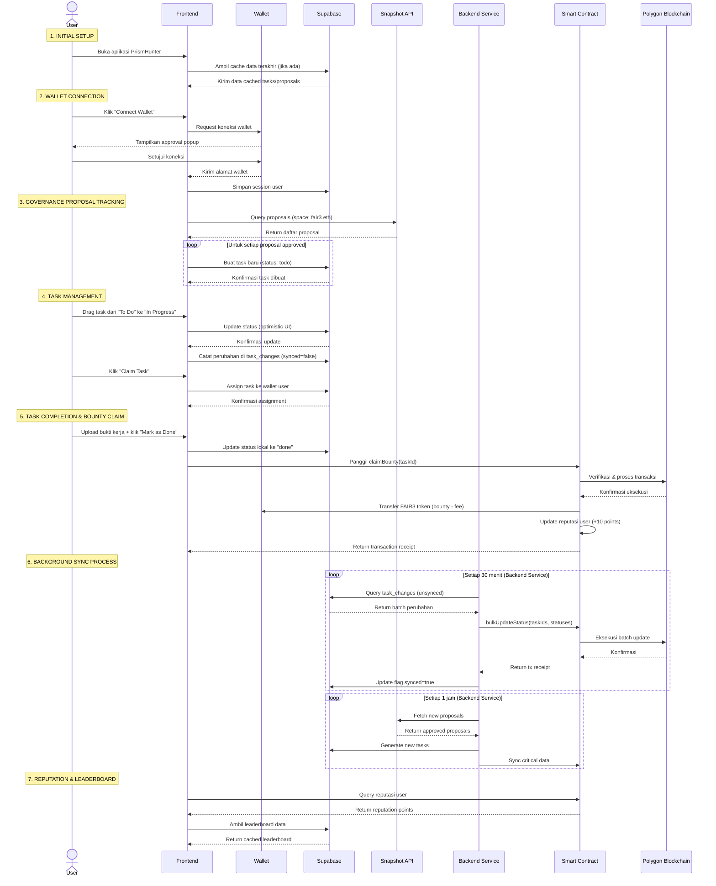

```mermaid
sequenceDiagram
    actor User
    participant Frontend
    participant Wallet
    participant Supabase
    participant Snapshot API
    participant Backend Service
    participant Smart Contract
    participant Polygon Blockchain

    Note over User: 1. INITIAL SETUP
    User->>Frontend: Buka aplikasi PrismHunter
    Frontend->>Supabase: Ambil cache data terakhir (jika ada)
    Supabase-->>Frontend: Kirim data cached tasks/proposals
    
    Note over User: 2. WALLET CONNECTION
    User->>Frontend: Klik "Connect Wallet"
    Frontend->>Wallet: Request koneksi wallet
    Wallet-->>User: Tampilkan approval popup
    User->>Wallet: Setujui koneksi
    Wallet-->>Frontend: Kirim alamat wallet
    Frontend->>Supabase: Simpan session user
    
    Note over User: 3. GOVERNANCE PROPOSAL TRACKING
    Frontend->>Snapshot API: Query proposals (space: fair3.eth)
    Snapshot API-->>Frontend: Return daftar proposal
    loop Untuk setiap proposal approved
        Frontend->>Supabase: Buat task baru (status: todo)
        Supabase-->>Frontend: Konfirmasi task dibuat
    end
    
    Note over User: 4. TASK MANAGEMENT
    User->>Frontend: Drag task dari "To Do" ke "In Progress"
    Frontend->>Supabase: Update status (optimistic UI)
    Supabase-->>Frontend: Konfirmasi update
    Frontend->>Supabase: Catat perubahan di task_changes (synced=false)
    
    User->>Frontend: Klik "Claim Task"
    Frontend->>Supabase: Assign task ke wallet user
    Supabase-->>Frontend: Konfirmasi assignment
    
    Note over User: 5. TASK COMPLETION & BOUNTY CLAIM
    User->>Frontend: Upload bukti kerja + klik "Mark as Done"
    Frontend->>Supabase: Update status lokal ke "done"
    Frontend->>Smart Contract: Panggil claimBounty(taskId)
    Smart Contract->>Polygon Blockchain: Verifikasi & proses transaksi
    Polygon Blockchain-->>Smart Contract: Konfirmasi eksekusi
    Smart Contract->>Wallet: Transfer FAIR3 token (bounty - fee)
    Smart Contract->>Smart Contract: Update reputasi user (+10 points)
    Smart Contract-->>Frontend: Return transaction receipt
    
    Note over User: 6. BACKGROUND SYNC PROCESS
    loop Setiap 30 menit (Backend Service)
        Backend Service->>Supabase: Query task_changes (unsynced)
        Supabase-->>Backend Service: Return batch perubahan
        Backend Service->>Smart Contract: bulkUpdateStatus(taskIds, statuses)
        Smart Contract->>Polygon Blockchain: Eksekusi batch update
        Polygon Blockchain-->>Smart Contract: Konfirmasi
        Smart Contract-->>Backend Service: Return tx receipt
        Backend Service->>Supabase: Update flag synced=true
    end
    
    loop Setiap 1 jam (Backend Service)
        Backend Service->>Snapshot API: Fetch new proposals
        Snapshot API-->>Backend Service: Return approved proposals
        Backend Service->>Supabase: Generate new tasks
        Backend Service->>Smart Contract: Sync critical data
    end
    
    Note over User: 7. REPUTATION & LEADERBOARD
    Frontend->>Smart Contract: Query reputasi user
    Smart Contract-->>Frontend: Return reputation points
    Frontend->>Supabase: Ambil leaderboard data
    Supabase-->>Frontend: Return cached leaderboard
```
